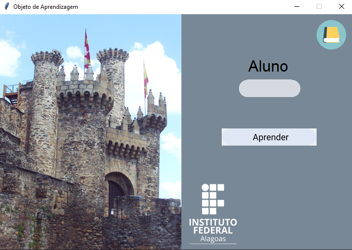
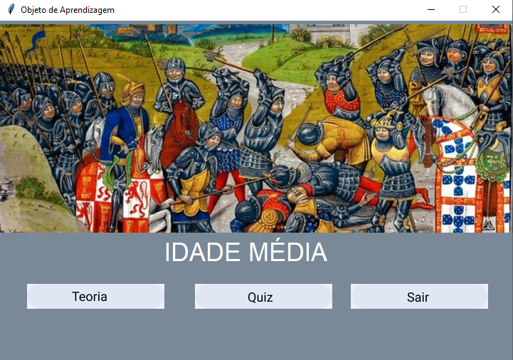
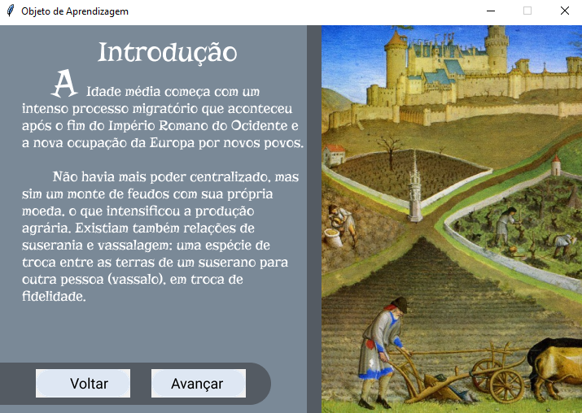
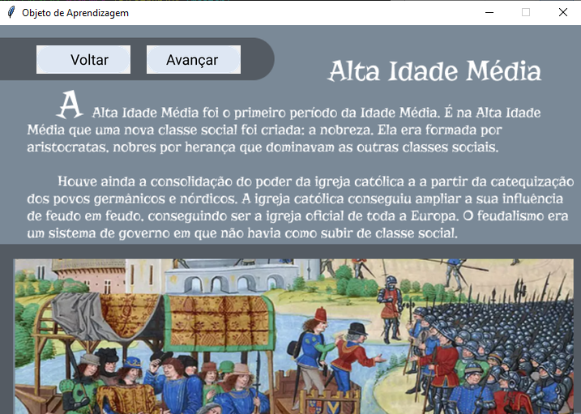
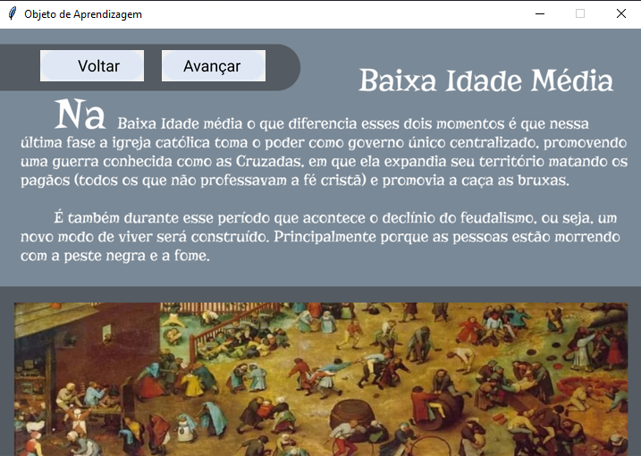
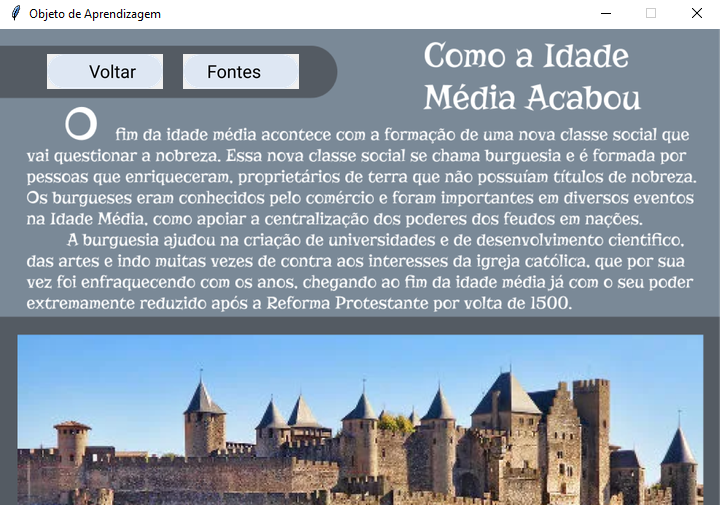
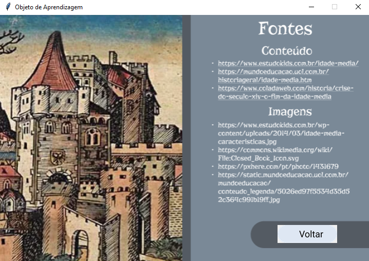

# Objeto de Aprendizado

  
 

## Tecnologias
- Python
- Tkinter

## Screenshots
### Primeira Tela

### Segunda tela

### Terceira tela

### Quarta tela

### Quinta tela

### Sexta tela

### Sétima tela

